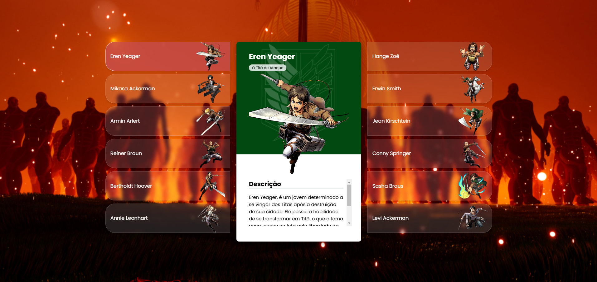

# Projeto de Site Esquadrão de Reconhecimento Attack on Titan

Este projeto é uma aplicação web que apresenta uma lista de reconhecimentos, permitindo que os usuários cliquem em cada item para exibir mais informações em cartões dinâmicos. O projeto utiliza HTML, CSS e JavaScript para fornecer uma interface interativa e responsiva.

## Tecnologias Utilizadas

- **HTML5**: Estrutura básica da aplicação.
- **CSS3**: Estilização da interface, utilizando o layout flexível e efeitos visuais.
- **JavaScript**: Interatividade na página, controlando a exibição dos cartões de reconhecimento.

## Funcionalidades

- Exibição de uma lista de reconhecimentos.
- Cartões que mostram informações detalhadas ao serem clicados.
- Efeitos de hover e transições suaves para uma melhor experiência do usuário.

## Estrutura do Projeto

/imagens # Imagens utilizadas no projeto /index.html # Página principal da aplicação /style.css # Estilos da aplicação /script.js # Script para interatividade

## Link

https://paulodiasred.github.io/projeto-site-attackontitan/
